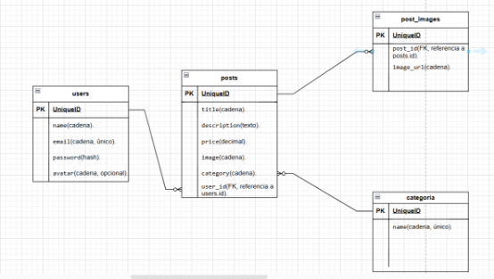

1\. Diseñar un boceto de las vistas del proyecto

Pantallas y componentes clave:

1\.1 Página principal

- Barra de navegación con enlaces a Registro, Inicio de sesión, Galería, y Mi perfil (si está autenticado).
- Hero con llamada a la acción para explorar las publicaciones.
- Sección de categorías populares o destacados.
- Footer con enlaces legales y de contacto.

1\.2 Registro de usuarios

- Formulario de registro con campos básicos: nombre, correo electrónico, contraseña, confirmación de contraseña.
- Botón de envío.

1\.3 Inicio de sesión

- Formulario de inicio de sesión con correo y contraseña.
- Opción de "Recuperar contraseña".
- Botón de envío.

1\.4 Mi perfil

- Información del usuario (nombre, correo, avatar).
- Listado de publicaciones creadas por el usuario con opciones para editar o eliminar.
- Botón para cerrar sesión.

1\.5 Formulario para crear una publicación

- Campos para: título, descripción, precio, imágenes (con vista previa), categoría.
- Botón de guardar.

1\.6 Galería de publicaciones

- Listado de publicaciones (tarjetas con imagen, título, precio).
- Filtro por categoría o precio.
- Paginación.

1\.7 Vista de detalle de una publicación

- Imagen grande, título, descripción, precio, nombre del vendedor.
- Botón para contactar al vendedor (o comprar, dependiendo del enfoque).
- Botón para regresar a la galería.

2\. Definir la navegación entre vistas

Navegación pública:

- Página principal.
- Registro de usuarios.
- Inicio de sesión.
- Galería de publicaciones.
- Vista de detalle de una publicación.

Navegación privada (requiere autenticación):

- Mi perfil.
- Formulario para crear una publicación.

Navegación propuesta (en React Router):

<Routes>

`  `{/\* Rutas públicas \*/}

`  `<Route path="/" element={<Home />} />

`  `<Route path="/register" element={<Register />} />

`  `<Route path="/login" element={<Login />} />

`  `<Route path="/gallery" element={<Gallery />} />

`  `<Route path="/post/:id" element={<PostDetail />} />

`  `{/\* Rutas privadas \*/}

`  `<Route path="/profile" element={<PrivateRoute component={Profile} />} />

`  `<Route path="/create-post" element={<PrivateRoute component={CreatePost} />} />

</Routes>

3\. Enlistar las dependencias del proyecto

Frontend (React):

- react y react-router-dom (navegación).
- axios (comunicación con el backend).
- formik y yup (formularios y validación).
- tailwindcss o styled-components (estilos).
- react-toastify (notificaciones).

Backend (Node.js):

- express (servidor).
- cors (control de acceso).
- jsonwebtoken (autenticación).
- bcrypt (hashing de contraseñas).
- sequelize (ORM para PostgreSQL).
- dotenv (variables de entorno).
- multer (manejo de archivos, como imágenes).

Base de datos:

- postgresql.

4\. Diseñar las tablas de la base de datos

Tablas propuestas:

4\.1 users

- id (PK, UUID).
- name (string).
- email (string, único).
- password (hashed).
- avatar (string, opcional).

4\.2 posts

- id (PK, UUID).
- title (string).
- description (text).
- price (decimal).
- image (string).
- category (string).
- user\_id (FK, referencia a users.id).

4\.3 categories

- id (PK, UUID).
- name (string, único).

4\.4 post\_images (para manejar múltiples imágenes por publicación).

- id (PK, UUID).
- post\_id (FK, referencia a posts.id).
- image\_url (string).

5\. Diseñar el contrato de datos de la API REST

Endpoints:

5\.1 Usuarios:

POST /api/users/register: Crear usuario.

POST /api/users/login: Iniciar sesión.

GET /api/users/profile: Obtener perfil (requiere token).

5\.2 Publicaciones:

GET /api/posts: Obtener publicaciones (filtro opcional por categoría).

GET /api/posts/:id: Obtener detalle de una publicación.

POST /api/posts: Crear publicación (requiere token).

PUT /api/posts/:id: Editar publicación (requiere token).

DELETE /api/posts/:id: Eliminar publicación (requiere token).

5\.3 Categorías:

GET /api/categories: Listar categorías.
